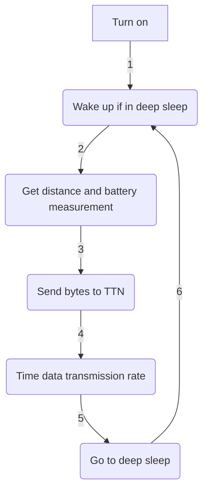

<div align="right">

[](./README.md) | [](./README_ES.md)

</div>


# <p align="justify"> THE THINGS NETWORK LoRaWAN COVERAGE TRACKER - MEDIALAB_ LPWAN: LORA TRACKER TO MEASURE COVERAGE PROVIDED BY OPEN GATEWAYS CONNECTED TO TTN </p>

<div align="center">

_Powered by_

[](https://www.arduino.cc/) [](https://www.lilygo.cc/)

</div>

___

<div align="justify">

## Table of contents
- [Introduction](https://github.com/medialablpwan/lorawaterlevelmonitoring/tree/main#introduction-leftwards_arrow_with_hook)
- [Main features](https://github.com/medialablpwan/lorawaterlevelmonitoring/tree/main#-main-features-leftwards_arrow_with_hook-)
- [To-Do list](https://github.com/medialablpwan/lorawaterlevelmonitoring/tree/main?tab=readme-ov-file#to-do-list-leftwards_arrow_with_hook)
- [Component list](https://github.com/medialablpwan/lorawaterlevelmonitoring/tree/main#-component-list-leftwards_arrow_with_hook-)
- [Connection list](https://github.com/medialablpwan/lorawaterlevelmonitoring/tree/main#-connection-list-leftwards_arrow_with_hook-)
- [Flowchart (Simplified!)](https://github.com/medialablpwan/lorawaterlevelmonitoring/tree/main#-flowchart-simplified-leftwards_arrow_with_hook-)
- [Code files](https://github.com/medialablpwan/lorawaterlevelmonitoring/tree/main#code-files-leftwards_arrow_with_hook)
- [Libraries](https://github.com/medialablpwan/lorawaterlevelmonitoring/tree/main#libraries-leftwards_arrow_with_hook)
- [Deployment experiment](https://github.com/medialablpwan/lorawaterlevelmonitoring/tree/main#-deployment-experiment-leftwards_arrow_with_hook-)
- [License](https://github.com/medialablpwan/lorawaterlevelmonitoring/tree/main#-license-leftwards_arrow_with_hook-)
- [Contact](https://github.com/medialablpwan/lorawaterlevelmonitoring/tree/main#-contact-leftwards_arrow_with_hook-)

</div>

___

<div align="justify">

## Introduction [:leftwards_arrow_with_hook:](https://github.com/medialablpwan/lorawaterlevelmonitoring/tree/main#table-of-contents)

With the objective of studying LoRa coverage quality at Gijón EPI Campus a physical device was required to send a message to all gateways conected to [The Things Network](https://www.thethingsnetwork.org/) and store the values for RSSI and SNR.

<div align="center">
  
</div>
<br/>

<p align="justify"> In this repo, you will find all the files and teaching guides required to fully understand and even take the creative freedom to improve this project. Folders and files have been given a self-explanatory name to make navigation more intuituve. </p>

___

### <p align="justify"> Main features [:leftwards_arrow_with_hook:](https://github.com/medialablpwan/lorawaterlevelmonitoring/tree/main#table-of-contents) </p>

- <p align="justify"> Developed using LilyGO LoRa32 OLED v2.1_1.6 (ESP32 based board with built-in LoRa capabilities that supports solar recharging and battery management) </p>

  <div align="center">
    
  </div>
  <br/>

<div align="justify">

- <p align="justify"> Custom PCB </p>

  <div align="center">
    
  </div>
  <br/>

> [!TIP]
> Consider soldering female pin connectors so the electronic components can simply be plugged in and unplugged if a repair has to be done

- <p align="justify"> Custom housing to fit all the elements in the most efficient way (Container + Solar panel holder + USB protector) </p>

  <div align="center">
    
  </div>
  <br/>
  <div align="center">
    
  </div>
  <br/>
  <div align="center">
    
  </div>
  <br/>

  > Assembly example:
  <div align="center">
    
  </div>
  <br/>

> [!WARNING]
> Clear colour PETG 3D printing filament is recommended to survive sun radiation and plastic deformations. An O-ring is also a good choice to fix and stabilize the sensor inside of the bell. Four M3 screws are needed to fix the assembly

___

<div align="justify">

### To-do list [:leftwards_arrow_with_hook:](https://github.com/medialablpwan/lorawaterlevelmonitoring/tree/main#table-of-contents)

The following list enumarates all the tasks involved in the researching process of this project and if they have been strictly completed:

- [ ] Full understanding of the development board and its pinout
```diff
- Some pins are conflictive due to poor manufacturer documentation, so testing is still being
- carried out
```

- [x] Full understanding of the sensor working mode and alternative modes

- [x] Sensor code implementation

- [x] LoRa code implementation

- [x] Low power code implementation

- [ ] Low power hardware components
```diff
- A transistor is being tried to be implemented so the sensor can be powered-on from the
- board's 5V pin and powered-off when going to deep slee, but it is getting tricky
```

</div>

<div align="center">
  

  <em>Electric schematic with the transistor</em>
</div>
<br/>

<div align="justify">

- [ ] PCB design
```diff
- As low power hardware has not been fully implemented, PCB has to wait
```

- [x] Casing 3D modeling
      
- [x] Data visualization app

</div>

___

### <p align="justify"> Component list [:leftwards_arrow_with_hook:](https://github.com/medialablpwan/lorawaterlevelmonitoring/tree/main#table-of-contents) </p>

<div align="center">

| Component | Model |
| ------------- | ------------- |
| Dev Module  | [LilyGO LoRa32 OLED v2.1_1.6](https://www.tinytronics.nl/shop/en/development-boards/microcontroller-boards/with-lora/lilygo-ttgo-t3-lora32-868mhz-v1.6.1-esp32) |
| Distance sensor  | [JSN-SR04T](https://www.tinytronics.nl/shop/en/sensors/distance/waterproof-ultrasonic-sensor-jsn-sr04t) |
| N-Channel MOSFET  | [IRF540N](https://www.amazon.es/AUKENIEN-Transistor-IRF9540N-Transistores-potencia/dp/B09TJJJXFY/ref=sr_1_7?crid=32LB9EZ8Q81R0&dib=eyJ2IjoiMSJ9.UqJKtI1towT4naZiatE1UAz3Y34XB4iKgzo6DKubwUI4RG1qKF_oX4Un0vPC8oIiA0EFIXieDXkMAloim0p3wd53thboFPEwhQTLzEYASTn-ir9NuyrY-VBMWOrpUmAWkdOI0-NIpeF4CGnXEBoyOUkkiZ55dz6yiT-UVQ5KhHcHhs34AOguiHi3PlFpSBtSQITXz6c9NVWxuNR-AgDC0xPEYvXwdFZ6dJQA9_fEU7LkaFrESMUXJF041slnfQtWcSPyd30nK2G8wFKLq59d9Q-yjADI9jY9gAWg0tpO2wI.uLG5EZvlmd2_UDPlM2LwyNBqoAfxE2lxi6x1rXETEug&dib_tag=se&keywords=irf540n&qid=1711314804&sprefix=IRF%2Caps%2C88&sr=8-7&th=1) |
| Resistor  | [2k2](https://www.amazon.es/BOJACK-valores-resistencias-pel%C3%ADcula-carbono/dp/B08FD1XVL6/ref=sr_1_5?keywords=resistor&qid=1703351987&sr=8-5) |
| Battery  | [18650](https://www.tinytronics.nl/shop/en/power/batteries/18650/eve-18650-li-ion-battery-3100mah-10a-inr18650-33v) |
| Solar panel  | [SYP-S0606](https://www.tinytronics.nl/shop/en/power/solar-energy/solar-panels/solar-panel-with-dc-dc-converter-and-usb-5v-1a) |
| PCB  | [Custom (file included)](https://github.com/medialablpwan/lorawaterlevelmonitoring/tree/main/pcb) |
| Housing  | [Custom (file included)](https://github.com/medialablpwan/lorawaterlevelmonitoring/tree/main/carc) |

</div>

___

### <p align="justify"> Connection list [:leftwards_arrow_with_hook:](https://github.com/medialablpwan/lorawaterlevelmonitoring/tree/main#table-of-contents) </p>

<div align="center">

| JSN-SR04T | Transistor | Resistor | 18650 Shield | SYP-S0606 | LilyGO |
| ------------- | ------------- | ------------- | ------------- | ------------- | ------------- |
| `trigger` | - | - | - | - | `13` |
| `echo` | - | - | - | - | `12` |
| `5v` | `S` | - | - | - | - |
| `GND` | - | `indifferent` | - | - | `GND` |
| - | `G` | `indifferent` | - | - | `15` |
| - | `D` | - | - | - | `5V` |
| - | - | - | `USB-In` | `USB-Out` | - |
| - | - | - | `USB-Out` | - | `USB-In` |

</div>

> Sketched it looks the following way:

<div align="center">
  
</div>
<br/>

> [!CAUTION]
> Board model used in the sketch above is a TTGO T3 v1.3, but pin numbers correspond to those on the v2.1_1.6

___

### <p align="justify"> Flowchart (Simplified!) [:leftwards_arrow_with_hook:](https://github.com/medialablpwan/lorawaterlevelmonitoring/tree/main#table-of-contents) </p>



___

<div align="justify">

### Code files [:leftwards_arrow_with_hook:](https://github.com/medialablpwan/lorawaterlevelmonitoring/tree/main#table-of-contents)

In this section, a brief description on how the code is distributed among files in [`medialablpwan/lorawaterlevelmonitoring/main/`](https://github.com/medialablpwan/lorawaterlevelmonitoring/tree/main/main), where the code is available and ready to flash or edit, is given:

- [`main.ino`](https://github.com/medialablpwan/lorawaterlevelmonitoring/blob/main/main/main.ino)
  ```C
  /*
  Definition of global functions
  Variables to be stored in the RTC memory
  'setup()' and 'loop()' functions
  */
  ```
- [`sensor.ino`](https://github.com/medialablpwan/lorawaterlevelmonitoring/blob/main/main/sensor.ino)
  ```C
  /*
  Functions and variables needed to make a sensor work
  */
  ```
- [`ddc.ino`](https://github.com/medialablpwan/lorawaterlevelmonitoring/blob/main/main/ddc.ino)
  ```C
  /*
  Functions and variables for the implementation of the dynamic data transfer rate
  */
- [`sleep.ino`](https://github.com/medialablpwan/lorawaterlevelmonitoring/blob/main/main/sleep.ino)
  ```C
  /*
  Functions to activate ESP32's deep sleep mode
  */
- [`ttn.ino`](https://github.com/medialablpwan/lorawaterlevelmonitoring/blob/main/main/ttn.ino)
  ```C
  /*
  Functions from LMIC library
  */
- [`configuration.h`](https://github.com/medialablpwan/lorawaterlevelmonitoring/blob/main/main/configuration.h)
  ```C
  /*
  Sensor macros and boolean toggles
  */
- [`credentials.h`](https://github.com/medialablpwan/lorawaterlevelmonitoring/blob/main/main/credentials.h)
  ```C
  /*
  OTAA keys for TTN synchronization
  */
- [`lmic_project_config.h`](https://github.com/medialablpwan/lorawaterlevelmonitoring/blob/main/main/lmic_project_config.h)
  ```C
  /*
  LoRa frequency band and radio chip selector
  */
A more in depth analysis is given in the code itself as comments explain what each function does.

</div>

> [!TIP]
> The most important files to edit are `sensor.ino`, where any sensor can be implemented, and `configuration.h`, where the peripherals' macros are declared

> [!CAUTION]
> Additional code may be needed if implementing I2C I/O. The functions to make them work are in the original project in [`TTGO-PAXCOUNTER-LoRa32-V2.1-TTN/main/main.ino`](https://github.com/rwanrooy/TTGO-PAXCOUNTER-LoRa32-V2.1-TTN/blob/master/main/main.ino)

___

<div align="justify">

### Libraries [:leftwards_arrow_with_hook:](https://github.com/medialablpwan/lorawaterlevelmonitoring/tree/main#table-of-contents)

- LilyGO board library (Paste the link on the `Preferences` tab and choose `TTGO LoRa32 OLED` as `Board` in Arduino IDE): https://github.com/Xinyuan-LilyGO/LilyGo-LoRa-Series/blob/master/boards/t3_s3_v1_x.json

- LMIC (Copy the contents of the project file `main/lmic_project_config.h` to the library file `arduino-lmic/project_config/lmic_project_config.h` and uncomment the proper frequency for your region. The sketch does always look at the library folder for the configured region!): https://github.com/mcci-catena/arduino-lmic

- QuickMedianLib (To obtain more solid distance values): https://github.com/luisllamasbinaburo/Arduino-QuickMedian

- ESP sleep (To reduce battery consumption): https://github.com/pycom/pycom-esp-idf/blob/master/components/esp32/include/esp_sleep.h

</div>

> [!NOTE]
> Other libraries, like SPI library, are easily downloadable from Arduino IDE

___

___

## <p align="justify"> Deployment experiment [:leftwards_arrow_with_hook:](https://github.com/medialablpwan/lorawaterlevelmonitoring/tree/main#table-of-contents) </p>

### <p align="justify"> The first unit has been deployed near the Polytechnic School of Engineering of Gijón: </p>

<div align="center">
  
</div>
<br/>
<div align="center">
  
</div>
<br/>

___

### Access the Grafana panel[^1] via this QR code or the link below it:

<div align="center">
  
</div>
<br/>

<p align="center"> http://4f566df1fed52c6e7fd5f661f64ae3eb.balena-devices.com:8080/d/vJhQNCZgz/sensores-jsn-sr04t-arroyo-de-san-miguel?from=now-24h&orgId=1&to=now&refresh=1m </p>

___

___

## <p align="justify"> License [:leftwards_arrow_with_hook:](https://github.com/medialablpwan/lorawaterlevelmonitoring/tree/main#table-of-contents) </p>

This project is licensed under the [GPL-3.0 license](https://github.com/rwanrooy/TTGO-PAXCOUNTER-LoRa32-V2.1-TTN/blob/master/LICENSE). Contains code from [rwanrooy/TTGO-PAXCOUNTER-LoRa32-V2.1-TTN](https://github.com/rwanrooy/TTGO-PAXCOUNTER-LoRa32-V2.1-TTN)

___

### <p align="justify"> Contact [:leftwards_arrow_with_hook:](https://github.com/medialablpwan/lorawaterlevelmonitoring/tree/main#table-of-contents) </p>

> [!IMPORTANT]
> We will kindly answer doubts and read suggestions: [](mailto:medialablpwan@gmail.com)
> 
> More info about our activities: [](https://www.linkedin.com/groups/9298597/)

_<p align="justify"> Authors: Daniel Rodríguez Moya, Óscar Gijón, Ramón Rubio and MediaLab\_ LPWAN Workgroup :shipit: </p>_

[^1]: Instructions on how to deploy Grafana panels are given on the repo [`medialablpwan/documentacion`](https://github.com/medialablpwan/documentacion).
